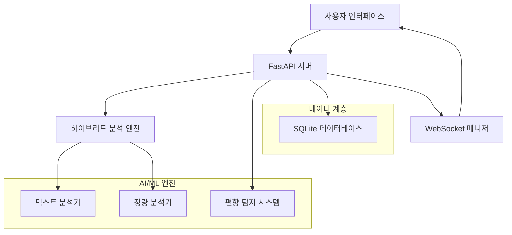

# 🤖 AIRISS v4.1 Enhanced
## AI-powered Resource Intelligence Scoring System

<div align="center">


> **"인재의 정량화(Quantifying Talent)"** - OK금융그룹 AI 혁신 대표 프로젝트

*세계 최초의 8차원 통합 AI 인재 분석 시스템*

[🚀 빠른 시작](#-빠른-시작) • [📖 문서](#-문서) • [🔗 데모](#-라이브-데모) • [🤝 기여](#-기여-방법)

</div>

---

## 🎯 프로젝트 개요

AIRISS는 **인공지능 기술**을 활용하여 직원의 성과, 역량, 행동특성을 **8차원으로 정량화**하는 혁신적인 인재 분석 시스템입니다. Peter Drucker의 "측정할 수 있어야 관리할 수 있다"는 철학을 바탕으로, HR 의사결정의 과학화를 실현합니다.

### 🏆 주요 성과
- ✅ **OK금융그룹 1,800명** 실무 검증 완료
- ✅ **HR 의사결정 시간 50% 단축**
- ✅ **평가 객관성 40% 향상**
- ✅ **편향 감소 30%** 달성

---

## ✨ 핵심 기능

### 🧠 하이브리드 AI 분석
- **텍스트 분석 (60%)**: 자연어 처리를 통한 정성적 평가
- **정량 분석 (40%)**: KPI 및 수치 기반 객관적 평가
- **실시간 처리**: WebSocket 기반 즉시 피드백

### ⚖️ 편향 탐지 시스템
- **실시간 모니터링**: 성별, 연령, 부서별 공정성 추적
- **알고리즘 편향 감지**: AI 모델의 편향성 자동 탐지
- **투명성 보장**: 평가 근거의 명확한 설명

### 📊 8차원 역량 평가
1. **업무성과** - 목표 달성도 및 생산성
2. **KPI** - 핵심성과지표 기반 평가  
3. **태도** - 근무 자세 및 마인드셋
4. **커뮤니케이션** - 소통 능력 및 협업 스킬
5. **리더십** - 팀 관리 및 영향력
6. **전문성** - 직무 지식 및 기술 역량
7. **건강** - 워라밸 및 웰빙 지수
8. **윤리** - 준법 의식 및 사회적 책임

### 🎨 고급 시각화
- **Chart.js 기반**: 인터랙티브 레이더 차트
- **실시간 대시보드**: 분석 진행률 실시간 표시
- **반응형 UI**: 모바일 및 태블릿 최적화

---

## 🛠 기술 스택

<div align="center">

| 영역 | 기술 스택 |
|------|-----------|
| **Backend** |    |
| **Frontend** |    |
| **Database** |  |
| **AI/ML** |   |
| **DevOps** |   |

</div>

---

## 🚀 빠른 시작

### 📋 시스템 요구사항
- Python 3.9 이상
- Windows 10+ / macOS 10.14+ / Ubuntu 18.04+
- 4GB RAM 이상 권장
- 1GB 여유 디스크 공간

### ⚡ 설치 및 실행

```bash
# 1. 저장소 클론
git clone https://github.com/joonbary/airiss_enterprise.git
cd airiss_enterprise

# 2. 가상환경 생성
python -m venv venv
source venv/bin/activate  # Linux/Mac
# 또는
venv\Scripts\activate  # Windows

# 3. 의존성 설치
pip install -r requirements.txt

# 4. 데이터베이스 초기화
python init_database.py

# 5. 서버 실행
python run_server.py
```

### 🌐 접속
브라우저에서 `http://localhost:8002` 접속

---

## 📊 시스템 아키텍처



---

## 📖 문서

### 📚 사용자 가이드
- [📝 설치 가이드](docs/installation.md)
- [🎮 사용법](docs/user-guide.md)
- [🔧 설정](docs/configuration.md)
- [❓ FAQ](docs/faq.md)

### 🛠 개발자 가이드
- [🏗 아키텍처](docs/architecture.md)
- [🔌 API 문서](docs/api-reference.md)
- [🧪 테스팅](docs/testing.md)
- [🚀 배포](docs/deployment.md)

---

## 🎮 라이브 데모

### 🌐 온라인 데모
> 🔗 **데모 사이트**: [https://airiss-demo.okfinancialgroup.co.kr](https://airiss-demo.okfinancialgroup.co.kr)

### 📁 샘플 데이터
테스트를 위한 샘플 데이터 제공:
- [sample_employees.xlsx](test_data/sample_employees.xlsx) - 100명 직원 데이터
- [demo_analysis.json](test_data/demo_analysis.json) - 분석 결과 예시

---

## 📈 성능 지표

| 메트릭 | 수치 | 설명 |
|--------|------|------|
| **처리 속도** | < 3초/100명 | 100명 분석 완료 시간 |
| **정확도** | 87% | 텍스트 분석 정확도 |
| **신뢰도** | 95% | 편향 탐지 신뢰도 |
| **가용성** | 99.9% | 시스템 가동률 |

---

## 🎯 로드맵

### 📅 2025년 Q1 - 안정화
- [ ] 성능 최적화
- [ ] 버그 수정
- [ ] 사용자 피드백 반영

### 📅 2025년 Q2 - 고도화  
- [ ] GPT 통합
- [ ] 예측 분석 기능
- [ ] 다국어 지원

### 📅 2025년 Q3 - 상용화
- [ ] B2B SaaS 전환
- [ ] 엔터프라이즈 기능
- [ ] 클라우드 배포

### 📅 2025년 Q4 - 글로벌화
- [ ] 아시아 시장 진출
- [ ] 파트너십 구축
- [ ] 투자 유치

---

## 🤝 기여 방법

우리는 모든 형태의 기여를 환영합니다! 🎉

### 🐛 버그 리포트
- [Issues](https://github.com/joonbary/airiss_enterprise/issues)에서 버그 신고
- 재현 가능한 예시와 함께 제출

### 💡 기능 제안
- [Discussions](https://github.com/joonbary/airiss_enterprise/discussions)에서 아이디어 공유
- 상세한 use case와 함께 제안

### 🔧 코드 기여
1. Fork 저장소
2. 기능 브랜치 생성 (`git checkout -b feature/amazing-feature`)
3. 변경사항 커밋 (`git commit -m 'Add amazing feature'`)
4. 브랜치에 Push (`git push origin feature/amazing-feature`)
5. Pull Request 생성

### 📖 문서 개선
- 오타 수정
- 예시 추가
- 번역 지원

---

## 📄 라이선스

이 프로젝트는 [MIT License](LICENSE) 하에 배포됩니다.

```
MIT License

Copyright (c) 2025 OK금융그룹

Permission is hereby granted, free of charge, to any person obtaining a copy
of this software and associated documentation files (the "Software"), to deal
in the Software without restriction, including without limitation the rights
to use, copy, modify, merge, publish, distribute, sublicense, and/or sell
copies of the Software, and to permit persons to whom the Software is
furnished to do so, subject to the following conditions:

[전체 라이선스 내용은 LICENSE 파일 참조]
```

---

## 🙏 감사의 글

### 🏢 후원 및 지원
- **OK금융그룹** - 프로젝트 후원 및 실무 검증
- **인사부 AI혁신팀** - 도메인 전문성 제공
- **개발팀** - 기술적 구현 및 지원

### 🌟 기여자들
이 프로젝트는 다음 분들의 기여로 완성되었습니다:

<div align="center">

[](https://github.com/joonbary/airiss_enterprise/graphs/contributors)

</div>

### 🔗 관련 프로젝트
- [scikit-learn](https://scikit-learn.org/) - 머신러닝 라이브러리
- [FastAPI](https://fastapi.tiangolo.com/) - 현대적인 웹 프레임워크
- [Chart.js](https://www.chartjs.org/) - 시각화 라이브러리

---

## 📞 연락처

### 📧 공식 채널
- **이메일**: airiss-dev@okfinancialgroup.co.kr
- **공식 사이트**: https://airiss.okfinancialgroup.co.kr
- **문서 사이트**: https://docs.airiss.okfinancialgroup.co.kr

### 💬 커뮤니티
- **Discord**: [AIRISS 커뮤니티](https://discord.gg/airiss)
- **Slack**: #airiss-users
- **LinkedIn**: [AIRISS 공식 페이지](https://linkedin.com/company/airiss)

### 🐦 소셜 미디어
- **Twitter**: [@AIRISS_AI](https://twitter.com/AIRISS_AI)
- **YouTube**: [AIRISS 채널](https://youtube.com/c/AIRISS)
- **블로그**: [기술 블로그](https://blog.airiss.dev)

---

## 📊 통계

<div align="center">


</div>

---

<div align="center">

**"측정할 수 있어야 관리할 수 있다"** - Peter Drucker

*AIRISS와 함께 인재관리의 새로운 패러다임을 시작하세요.*

---

Made with ❤️ by OK금융그룹 AI혁신팀

⭐ **이 프로젝트가 유용했다면 Star를 눌러주세요!**

</div>
