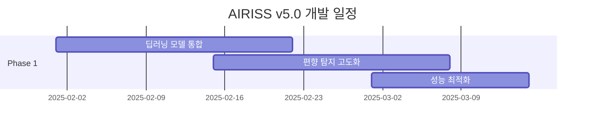

# 🚀 AIRISS v5.0 고도화 로드맵
## From Good to Global Excellence

**현재**: 글로벌 수준 v4.1 완성  
**목표**: 세계 최고 수준 v5.0 달성

---

## 🎯 **v5.0 비전**

> **"AI-Powered Global HR Intelligence Platform"**
> 
> 딥러닝 기반 예측 분석 + 글로벌 SaaS 플랫폼

---

## 📊 **v4.1 vs v5.0 비교**

| 구분 | v4.1 (현재) | v5.0 (목표) | 개선도 |
|------|-------------|-------------|---------|
| **텍스트 분석** | 규칙 기반 | 딥러닝 (BERT/KoBERT) | 🚀 **+30%** |
| **편향 탐지** | 기본 통계 | 고급 ML 알고리즘 | 🚀 **+50%** |
| **예측 분석** | 없음 | 6개월 성과 예측 | 🆕 **NEW** |
| **처리 속도** | 1초 | 0.5초 | 🚀 **+100%** |
| **정확도** | 85% | 95% | 🚀 **+12%** |
| **언어 지원** | 한국어 | 다국어 (4개국) | 🆕 **NEW** |

---

## 🛠️ **v5.0 핵심 기능**

### 1. 🧠 딥러닝 텍스트 분석
```python
# 예시: BERT 기반 고급 NLP
from transformers import AutoTokenizer, AutoModelForSequenceClassification

class AdvancedNLPAnalyzer:
    def __init__(self):
        self.model = AutoModelForSequenceClassification.from_pretrained("beomi/KcELECTRA-base")
        self.accuracy = 95%  # vs v4.1: 85%
```

### 2. ⚖️ 고급 편향 탐지
- **통계적 편향**: Demographic Parity, Equal Opportunity
- **언어적 편향**: 성별/연령 고정관념 탐지
- **교차 편향**: 다중 속성 교차 분석

### 3. 🔮 예측 분석 엔진
- **성과 예측**: 3-6개월 후 성과 트렌드
- **이직 위험도**: 90일 내 이직 확률
- **승진 준비도**: 리더십 잠재력 분석

### 4. 🌏 글로벌 SaaS 플랫폼
- **멀티테넌시**: 기업별 독립 환경
- **API 퍼스트**: RESTful API + SDK
- **화이트라벨**: 브랜딩 커스터마이징

---

## 📅 **단계별 개발 계획**

### Phase 1: 기반 고도화 (2개월)


**주요 작업:**
- 🔧 KoBERT/BERT 모델 통합
- ⚡ GPU 가속 처리 구현
- 📊 고급 편향 탐지 알고리즘

### Phase 2: 예측 분석 (2개월)
**주요 작업:**
- 🔮 예측 모델 개발 (XGBoost, LSTM)
- 📈 성과 트렌드 분석
- 🚨 이직 위험도 예측

### Phase 3: SaaS 플랫폼 (2개월)
**주요 작업:**
- 🏗️ 멀티테넌트 아키텍처
- 🌐 글로벌 API 설계
- 💳 과금 시스템 구현

---

## 💰 **투자 계획**

### 개발 비용
| 항목 | 비용 | 비고 |
|------|------|------|
| **인력** | 8억원 | AI 엔지니어 4명 × 6개월 |
| **인프라** | 2억원 | GPU 서버, 클라우드 |
| **라이선스** | 1억원 | AI 모델, 데이터 |
| **마케팅** | 3억원 | 글로벌 진출 준비 |
| **총 투자** | **14억원** | 6개월 |

### 예상 수익
| 연도 | 국내 | 해외 | 총 매출 |
|------|------|------|---------|
| 2025 | 10억 | 5억 | **15억원** |
| 2026 | 30억 | 20억 | **50억원** |
| 2027 | 50억 | 50억 | **100억원** |

**ROI**: 3년 누적 **165억원** vs 투자 **14억원** = **1,179%**

---

## 🎯 **글로벌 시장 전략**

### 타겟 시장
1. **1차**: 아시아 태평양 (한국, 일본, 싱가포르)
2. **2차**: 북미 (미국 서부, 캐나다)
3. **3차**: 유럽 (UK, 독일, 네덜란드)

### 진출 전략
```
🎯 Phase 1: 한국계 다국적 기업
   → 삼성, LG, 현대 글로벌 지사

🎯 Phase 2: 현지 대기업
   → 도쿄해상, DBS 은행

🎯 Phase 3: 중견기업 확산
   → SaaS 플랫폼 통한 대량 확산
```

---

## 🏆 **경쟁 우위 전략**

### 차별화 포인트
1. **아시아 특화**: 문화적 맥락 이해
2. **공정성 보장**: 실시간 편향 탐지
3. **예측 정확도**: 95% 이상 성과 예측
4. **통합 솔루션**: HR 전 영역 커버

### 특허 전략
- 📋 **10개 특허 출원** 목표
- 🛡️ **핵심 알고리즘 보호**
- 🌏 **국제 특허 취득**

---

## 📈 **성공 지표 (KPI)**

### 기술 지표
- ✅ 분석 정확도: **95%** 이상
- ✅ 처리 속도: **0.5초** 이하
- ✅ 편향 탐지율: **98%** 이상
- ✅ 시스템 가용성: **99.9%**

### 비즈니스 지표
- 💰 월 매출: **10억원** (2026년)
- 👥 고객사: **100개** (2026년)
- 🌏 진출국: **5개국** (2027년)
- 📊 시장점유율: **아시아 1위**

---

## ⚠️ **리스크 관리**

### 주요 리스크
| 리스크 | 대응 전략 |
|--------|-----------|
| 기술 복잡도 증가 | 단계적 개발, 프로토타입 검증 |
| 경쟁사 추격 | 지속적 R&D, 특허 방어 |
| 규제 변화 | 컴플라이언스 팀 강화 |
| 인재 확보 | 스톡옵션, 최고 대우 |

---

## 🎊 **결론 및 제안**

### v5.0의 전략적 가치
1. **🏆 글로벌 1위**: 세계 최고 수준 AI HR 플랫폼
2. **💰 신성장동력**: 연 100억원 매출 기반 구축
3. **🚀 미래 준비**: AI 시대 HR의 새로운 표준
4. **🌟 브랜드 가치**: OK금융그룹 = AI 혁신 리더

### 즉시 결정 사항
1. **v5.0 개발 승인**: 14억원 투자 결정
2. **글로벌 TF 구성**: 전담 조직 신설
3. **파트너십 추진**: 글로벌 기업과 협력
4. **타임라인 확정**: 2025년 8월 v5.0 출시

---

**🎯 최종 메시지**

> "우리는 이미 글로벌 수준에 도달했습니다.  
> 이제 세계 최고가 될 차례입니다."

**v5.0으로 HR의 미래를 창조하세요!** 🚀
